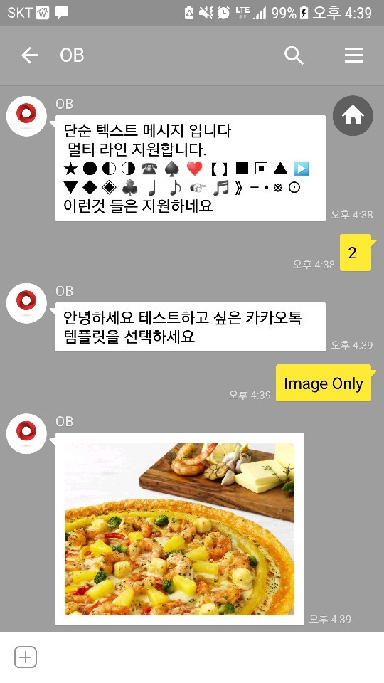
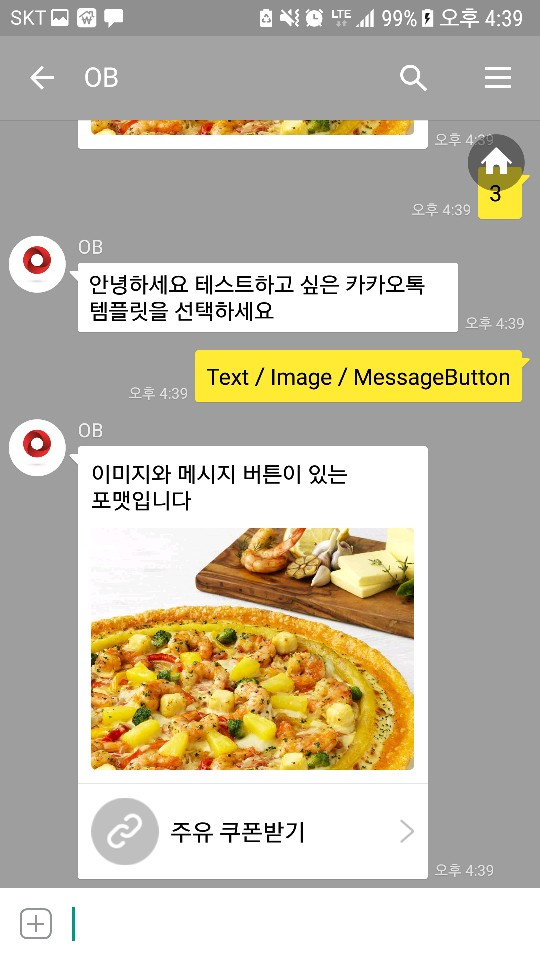
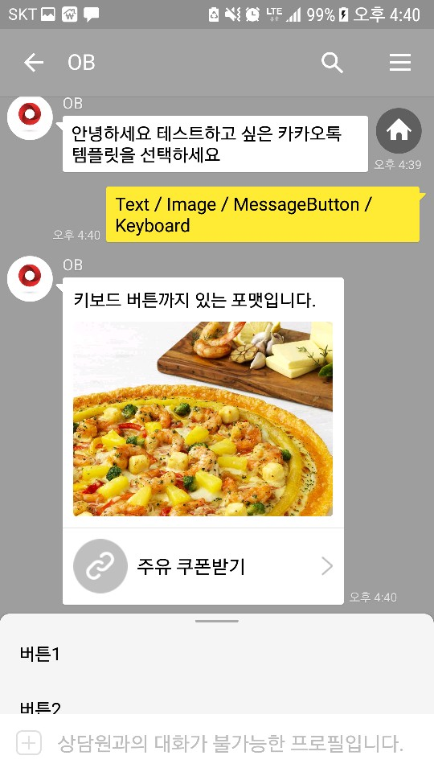

Lab402 - 카카오톡의 다양한 Response 타입 사용하기
=======

카카오톡에서 제공하는 다음 포맷을 사용하는 예제 입니다.
* Text
* Image
* Message Button
* Keyboard 


**Step 1. Bot에서 카카오톡 커넥터 등록하기**
=======
이전 Lab에의 커넥터 등록 내용을 참고하시면 됩니다.

Text나 단순 List(Keyboard) 형태가 아닌 조합된 유형의 메시지 포맷을 사용하고자 할 경우에는 Custom Component를 작성하여 원하는 Response를 생성해 주어야 합니다.

Custom Component 작성과 관련해서는 이전 Lab을 참고 하세요

# Text 포맷
```javascript
conversation.reply(MessageModel.kakaoConversationMessage("단순 텍스트 메시지 입니다\n 멀티 라인 지원합니다."));
```

# Image 포맷
```javascript
let photo = MessageModel.photoObject("https://akamai.pizzahut.co.kr/images/products/top/P_RG_GB_1.jpg", 640, 480);

conversation.reply(MessageModel.kakaoConversationMessage(null, photo));
```

# Message Button 포맷
```javascript
let photo = MessageModel.photoObject("https://akamai.pizzahut.co.kr/images/products/top/P_RG_GB_1.jpg", 640, 480);

let message_button = MessageModel.message_buttonObject("주유 쿠폰받기", "http://www.naver.com");

conversation.reply(MessageModel.kakaoConversationMessage("이미지와 메시지 버튼이 있는 포맷입니다", photo, message_button));
```

# Message Button + Keyboard 조합 포맷
```javascript
let photo = MessageModel.photoObject("https://akamai.pizzahut.co.kr/images/products/top/P_RG_GB_1.jpg", 640, 480);

let message_button = MessageModel.message_buttonObject("주유 쿠폰받기", "http://www.naver.com");

let buttons = ["버튼1", "버튼2","버튼3"];

let keyboard = MessageModel.keyboardObject(buttons);

conversation.reply(MessageModel.kakaoConversationMessage("키보드 버튼까지 있는 포맷입니다.", photo, message_button, keyboard));
```

# CUSTOM CODE 배포하기
labfiles\ bots_18.1.5\bots\toolsConfig.json을 제공된 환경에 맞게 수정합니다.

다음 명령어를 수행하여 컴포넌트를 배포합니다.
```
node omce-deploy.js ../../bots_18.1.5/bots/toolsConfig.json -u <YOUR_ID> -p <YOUR_PASSWORD>
```
# BOT FLOW
기존 카카오톡이 연결되어 있는 Bot Flow에 위에서 생성한 Custom Component를 연결합니다. 컴포넌트 등록은 Custom Component 구현 Lab을 참고합니다.

컴포넌트가 연결되었으면 Bot Flow에 다음을 추가 합니다.
```
  variableList:
    component: "System.List"
    properties: 
      prompt: "안녕하세요 테스트하고 싶은 카카오톡 템플릿을 선택하세요"
      options: 
      - label: "Text Only"
        value: "1" 
      - label: "Image Only"
        value: "2" 
      - label: "Text / Image / MessageButton"
        value: "3" 
      - label: "Text / Image / MessageButton / Keyboard"
        value: "4" 
      variable : "option"
    transitions: {}
    
  kakao:
   component: "kakaomessage"
   properties:
      msgtype: "${option}"
   transitions: 
      return : "done"
```
# 테스트
## Text / Image View


## Message Button View


## Keyboard View


