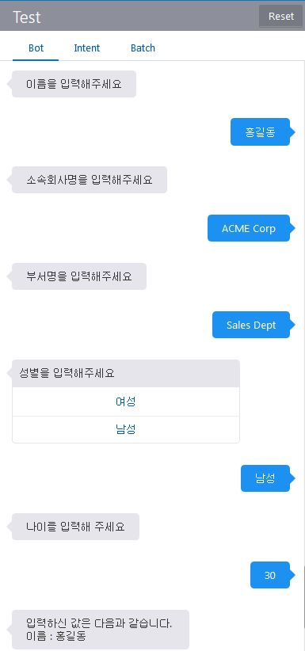

Lab800 - Custom Component를 사용한 다수 입력 처리
=======

사용자로 부터 다수의 입력을 받아 비즈니스 로직을 처리하여야 할 경우 BOT FLOW에서 다수의 입력을 처리하지 않고 하나의 Custom Component를 사용하여 사용자와 대화를 주고 받으며 입력을 처리하는 Component를 개발하여 이용할 수 있습니다.

# Custom Component Code
Component에서 빠져 나가지 않고 USER와 대화를 주고 받으며 계속 Component 로직을 수행하는 예제 입니다.

전체 code는 
labfiles\bots_18.1.5\bots\components\validation.js 참고

```javascript
  conversation.reply(MessageModel.textConversationMessage("이름을 입력해주세요"));
  ... 
  conversation.reply(MessageModel.textConversationMessage("소속회사명을 입력해주세요"));
  ...
  conversation.reply(MessageModel.textConversationMessage("부서명을 입력해주세요"));
  ...
  conversation.reply(MessageModel.textConversationMessage("성별을 입력해주세요", genders));
  ...
  conversation.reply(MessageModel.textConversationMessage("나이를 입력해 주세요"));

```

# CUSTOM CODE 배포하기
labfiles\ bots_18.1.5\bots\toolsConfig.json을 제공된 환경에 맞게 수정합니다.

다음 명령어를 수행하여 컴포넌트를 배포합니다.
```
node omce-deploy.js ../../bots_18.1.5/bots/toolsConfig.json -u <YOUR_ID> -p <YOUR_PASSWORD>
```
# BOT FLOW
기존 Bot Flow에 위에서 생성한 Custom Component를 연결합니다. 컴포넌트 등록은 Custom Component 구현 Lab을 참고합니다.

컴포넌트가 연결되었으면 Bot Flow에 다음을 추가 합니다.
아래 Component 호출 하나로 5번의 User Input을 처리하는 대화를 작성할 수 있습니다.

```
  validation:
    component: "validation"
    transitions:
      return: "done"
```
# 테스트
## BOT Test UI를 통해 확인하기
이름, 소속회사, 부서명, 성별, 나이를 질문하고 대답하는 FLOW를 테스트 합니다.



